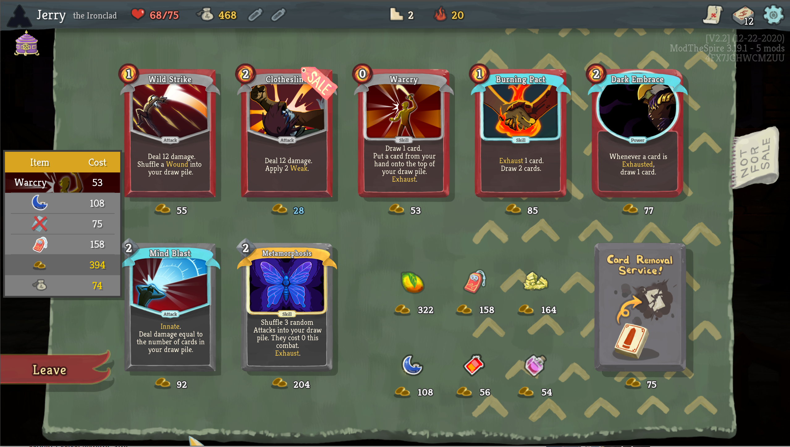

# Shopping List

Plan your shopping ahead of time instead of pulling up a calculator! When entering a shop, the mod will add a *Shopping List* panel to the shop screen.

### Legend

* Each shop item is displayed as in a row with an image and a cost to represent it.
  * Cards have their names displayed and their card art as their background.
  * Relics and potions are directly displayed.
  * Card removals have a icon with a card and a red X over it.
* The **gold** icon represents the total price of all items in the list.
* The **money pouch** icon represents the remaining gold after purchasing everything in the list.

### Usage

* Click and hold on to the orange bar to *drag* the list around to not block the view.
* **Alt+Click** an item to add it to the shopping list.
* **Click** an item on the list to remove it.

### Configurating

Go to **Mods > Shopping List > Config** to change the mod's functions. Currently you can:

* Toggle whether card arts are used to represent cards in the shopping list.